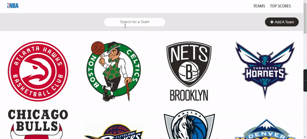
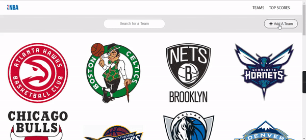
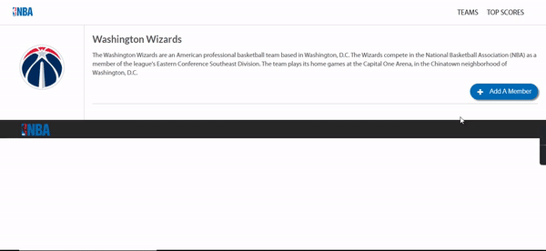

# NPA Teams Website

This is a simple MERN stack project which display all npa teams and details about each team and its members.

This project was made as a task on ITI scholarship, Frontend & Cross-Platform Mobile App development track.

you can view the live version from [here](https://npateams.netlify.app/).
***

***
## Tools & Technologies

- Frontend Side is built with: ReactJS, Semantic UI library.
    - deployed on Netlify

- Backend Side is implemented using: Node.js, Express
    - deployed on Repl.it, you can view [here](https://npabackendapis.nohaa.repl.co/).

- Database is implemented using MongoDB.

## Installation

- Perquisites
    install node.js and npm
- Run the dev server for react project:
 - open terminal into npateams folder
 - run `npm install` to install all dependencies.a
 - run `npm start` to start dev server on [http://localhost:3000/](http://localhost:3000)
 
 - backend is already running on [here](https://npabackendapis.nohaa.repl.co/)

****
## NPA teams Backend API documentation

all endpoints require no Authentication.
This API is implemented using Node.js and Express.
The database that is implemented on MonogDB has 4 collections:

1- home collection:
    - it has the units that's rendered in home page, included 3 objects:

        1- slider: which contains the covers of home page top slider.

        2- blocks: which contains the images of the highlights section.

        3- poll: which contains the teams that is included into the poll for the poll section.

    - this collection has 3 methods:
        - get all home objects: `/api/home`
        - Post a new home item into any of three objects: `/api/home`
        - update/patch any of three objects by id: `/api/home/:id`

2- Subscription collection:
    - All emails that are registered for subscription are stored into it.

    - this collection has 2 methods:
        - get all emails that are registered: `/api/subscriptions`.
        - post a new email: `/api/subscription'

3- Logos collection: 
    - This is where a logo for a new added team is stored.
    
    - this collection has 2 methods:
        - get a logo of a team by a team name: `/api/logos/:teamName`
        - post a new logo for a team: `/api/logos/upload`
        - delete a logo of a team by a team name: `api/logos/:teamName`

4- Teams collections:
    - This collection contains all teams that are rendered on teams page and the details and members of each team which are rendered on every team page.

    - This collection has 5 methods:
        - get all teams: `/api/teams`
        - get a team by id: `/api/teams/:id`
        - post a new team: `/api/teams`
        - update/patch a team: `api/teams/:id`
        - delete a team: `api/teams/:id`

